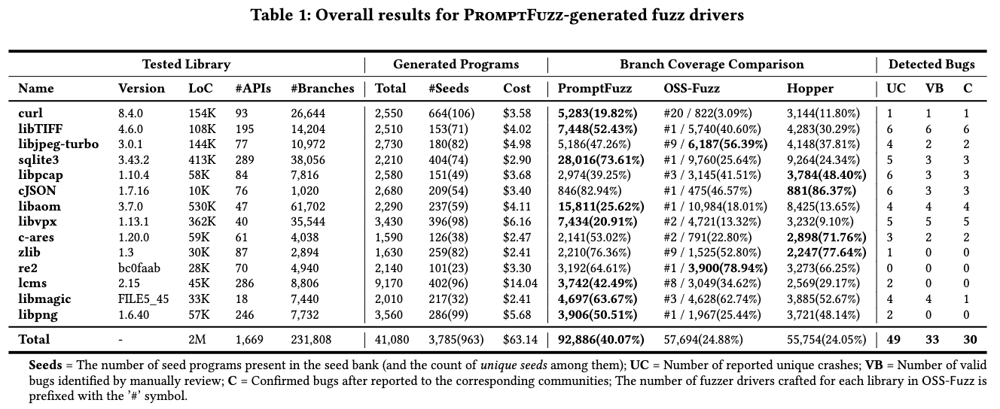

# Prompt Fuzzing for Fuzz Driver Generation
PromtFuzz is an automated tool that generates high-quality fuzz drivers for libraries via a fuzz loop constructed on mutating LLMs' prompts. The fuzz loop of PromptFuzz aims to guide the mutation of LLMs' prompts to generate programs that cover more reachable code and explore complex API interrelationships, which are effective for fuzzing.


PromptFuzz is currently regarded as the leading approach for generating fuzz drivers both in academia and industry. The fuzz drivers generated by **PromptFuzz achieved a branch coverage of 40.12\% on the tested libraries**, which is 1.61x greater than  *[OSS-Fuzz](https://github.com/google/oss-fuzz)* and 1.67x greater than *[Hopper](https://arxiv.org/pdf/2309.03496)*. Besides, PromptFuzz detected 33 valid security bugs from 49 unique crashes.



## ✨Features
- **Multiply LLM support**: Supports the general LLMs: Codex, Inocder, ChatGPT, and GPT4 (Currently tested on ChatGPT).
- **Context-based Prompt**: Construct LLM prompts with the automatically extracted library context.
- **Powerful Sanitization**: The program's syntax, semantics, behavior, and coverage are thoroughly analyzed to sanitize the problematic programs.
- **Prioritized Mutation**: Prioritizes mutating the library API combinations within LLM's prompts to explore complex interrelationships, guided by code coverage.
- **Fuzz Driver Exploitation**: Infers API constraints using statistics and extends fixed API arguments to receive random bytes from fuzzers.
- **Fuzz engine integration**: Integrates with grey-box fuzz engine: LibFuzzer.


## 🏆Trophy
The fuzz drivers generated by PromptFuzz can detect a wide range of bugs, most of which are security bugs. For instances, [CVE-2023-6277](https://nvd.nist.gov/vuln/detail/CVE-2023-6277), [CVE-2023-52355](https://nvd.nist.gov/vuln/detail/CVE-2023-52355) and [CVE-2023-52356](https://nvd.nist.gov/vuln/detail/CVE-2023-52356).

PromptFuzz detects uniquely interesting bugs:

| <b>ID<b> | **Library** | **Buggy Function**                          | **Bug Type** | **Status** | **Track Link** |
|-------------|------------------|-----------------------------------------|-------------------|-----------------|-------------------|
| 1.          | libaom           | highbd_8_variance_sse2                  | SEGV              | Confirmed       | [3489](https://bugs.chromium.org/p/aomedia/issues/detail?id=3489)              |
| 2.          | libaom           | av1_rc_update_framerate                 | Uninitialized Stack              | Confirmed       | [3509](https://bugs.chromium.org/p/aomedia/issues/detail?id=3509)              |
| 3.          | libaom           | timebase_units_to_ticks                 |  Integer Overflow               | Confirmed       | [3510](https://bugs.chromium.org/p/aomedia/issues/detail?id=3510)              |
| 4.          | libaom           | encode_without_recode                 |  SEGV               | Confirmed       | [3534](https://bugs.chromium.org/p/aomedia/issues/detail?id=3534)              |
| 5.          | libvpx           | vp8_peek_si_internal                    | SEGV              | Confirmed       | [1817](https://bugs.chromium.org/p/webm/issues/detail?id=1817)              |
| 6.          | libvpx           | update_fragments                        | Buffer Overflow                | Confirmed       | [1827](https://bugs.chromium.org/p/webm/issues/detail?id=1827)              |
| 7.          | libvpx           | vp8e_encode                             | Integer Overflow                | Confirmed       | [1828](https://bugs.chromium.org/p/webm/issues/detail?id=1828)              |
| 8.          | libvpx           | encode_mb_row                           | Integer Overflow                | Confirmed       | [1831](https://bugs.chromium.org/p/webm/issues/detail?id=1831)              |
| 9.          | libvpx           | vpx_free_tpl_gop_stats                  | SEGV                | Confirmed       | [1837](https://bugs.chromium.org/p/webm/issues/detail?id=1837)              |           |
| 10.         | libmagic         | apprentice_map                          | Buffer Overflow                | Waiting         | [481](https://bugs.astron.com/view.php?id=481)               |
| 11.         | libmagic         | magic_setparam                          | Buffer Overflow                | Waiting         | [482](https://bugs.astron.com/view.php?id=482)               |
| 12.         | libmagic         | check_buffer                            | Buffer Overflow                | Confirmed         | [483](https://bugs.astron.com/view.php?id=483)               |
| 13.         | libmagic         | mget                                    | Integer Overflow                | Waiting         | [486](https://bugs.astron.com/view.php?id=486)               |
| 14.         | libTIFF          | TIFFOpen                                | OOM               | Confirmed       | [614](https://gitlab.com/libtiff/libtiff/-/issues/614)               |
| 15.         | libTIFF          | PixarLogSetupDecode                     | OOM               | Confirmed       | [619](https://gitlab.com/libtiff/libtiff/-/issues/619)               |
| 16.         | libTIFF          | TIFFReadEncodedStrip                    | OOM               | Confirmed       | [620](https://gitlab.com/libtiff/libtiff/-/issues/620)               |
| 17.         | libTIFF          | TIFFReadRGBAImageOriented               | OOM               | Confirmed       | [620](https://gitlab.com/libtiff/libtiff/-/issues/620)               |
| 18.         | libTIFF          | TIFFRasterScanlineSize64                | OOM               | Confirmed       | [621](https://gitlab.com/libtiff/libtiff/-/issues/621)               |
| 19.         | libTIFF          | TIFFReadRGBATileExt                     | SEGV              | Confirmed       | [622](https://gitlab.com/libtiff/libtiff/-/issues/622)               |
| 20.         | sqlite3          | sqlite3_unlock_notify                   | Null Pointer crash                | Confirmed       | [e77a5](https://www.sqlite.org/forum/forumpost/e77a5c3445)             |
| 21.         | sqlite3          | sqlite3_enable_load_extension           | Null Pointer crash                | Confirmed       | [9ce83](https://www.sqlite.org/forum/forumpost/9ce835fe96)             |
| 22.         | sqlite3          | sqlite3_db_config                       | Null Pointer crash                | Confirmed       | [5e3fc](https://www.sqlite.org/forum/forumpost/5e3fc453a6)             |
| 23.         | c-ares           | config_sortlist                         | Memory Leak                | Confirmed       | [d62627](https://github.com/c-ares/c-ares/commit/d62627e8b39ef793c3b1c7b054724b0d581eb4fb)           |
| 24.         | c-ares           | config_sortlist                         | Memory Leak                | Confirmed       | [d62627](https://github.com/c-ares/c-ares/commit/d62627e8b39ef793c3b1c7b054724b0d581eb4fb)           |
| 25.         | libjpeg-turbo    | tj3DecodeYUV8                           | Integer Overflow                | Confirmed       | [78eaf0](https://github.com/libjpeg-turbo/libjpeg-turbo/security/advisories/GHSA-x7cp-qgf3-9896)           |
| 26.         | libjepg-turbo    | tj3LoadImage16                          | OOM               | Confirmed       | [735](https://github.com/libjpeg-turbo/libjpeg-turbo/issues/735)               |
| 27.         | libpcap          | pcap_create                             | File Leak               | Confirmed       | [1233](https://github.com/the-tcpdump-group/libpcap/issues/1233)              |
| 28.         | libpcap          | pcapint_create_interface                | Null Pointer crash                | Confirmed       | [1239](https://github.com/the-tcpdump-group/libpcap/issues/1239)              |
| 29.         | libpcap          | pcapint_fixup_pcap_pkthdr               | Misaligned Address               | Confirmed       | -                 |             |
| 30.         | cJSON            | cJSON_SetNumberHelper                   | Error Cast                | Confirmed         | [805](https://github.com/DaveGamble/cJSON/issues/805)               |
| 31.         | cJSON            | cJSON_CreateNumber                      | Error Cast                | Confirmed       | [806](https://github.com/DaveGamble/cJSON/issues/806)               |
| 32.         | cJSON            | cJSON_DeleteItemFromObjectCaseSensitive | TimeOut                | Confirmed       | [807](https://github.com/DaveGamble/cJSON/issues/807)               |
| 33.         | curl             | parseurl                                | Assertion Failure      | Confirmed       | [12775](https://github.com/curl/curl/pull/12775) |

## 🔧 Build Pre-requisites

### 1. 🐳Using Docker (Recommend)
You can use the [Dockerfile](Docekrfile) to build the environment:
```
docker build -t promptfuzz .
docker run -it promptfuzz bash
```

### 2. Library build scripts
Before you apply this fuzzer for a new project, you **must** have a automatic build script to build your project to prepare the required data (e.g., headers, link libraries, fuzzing corpus and etc.), like [OSS-Fuzz](https://github.com/google/oss-fuzz). See [Preparation](data/README.md).


We have parpared the build scripts for some popular open source libraries, you can refer to the **data** directory.


### 3. Build Environment Locally (Optional)
If you prefer to set up the environment locally instead of using Docker, you can follow the instructions below:

**Requirements:**
- Rust stable
- LLVM and Clang (built with compiler-rt)
- wllvm (installed by `pip3 install wllvm`)

You can download llvm and clang from this [link](https://github.com/llvm/llvm-project/releases/tag/llvmorg-15.0.0) or install by [llvm.sh](https://apt.llvm.org/).

Explicit dependency see [Dockerfile](Dockerfile).

If you prefer build llvm manually, you can build clang with compiler-rt and libcxx from source code following the config:
```
cmake -S llvm -B build -G Ninja -DCMAKE_BUILD_TYPE=Release -DLLVM_ENABLE_PROJECTS="clang;lld" \
 -DLLVM_ENABLE_RUNTIMES="libcxx;libcxxabi;compiler-rt;" \
 -DCMAKE_BUILD_TYPE=Release -DLIBCXX_ENABLE_STATIC_ABI_LIBRARY=ON \
 -DLIBCXXABI_ENABLE_SHARED=OFF  -DCMAKE_C_COMPILER=clang -DCMAKE_CXX_COMPILER=clang++ 
 ```

### 4. LLM dependency (Optional)
> Those custom LLMs have not been fully supported and tested in PromptFuzz. If you just want to use PromptFuzz, please choose ChatGPT or GPT4.

Currently, the primary programming language used for implementation is **Rust**, while a few **Python** scripts are utilized to invoke specific LLM models.

If you want to invoke the self-build LLMs (i.e., Incoder), the following is the requirements for building **Python** dependency:
```
- pytorch (pip3 install torch)
- transformers (pip3 install transformers)
- yaml (pip3 install PyYAML)
- fastapi (pip3 install fastapi[all])
```

## 🦄Basic Usage

### 1. Build library
Run the script in the **prompt_fuzz/data** directory, to prepare the required data of this library.

After the build process is finished, the data of this library is stored under **prompt_fuzz/output/build/**.

### 2. Export the LLM API KEY

You must have an `OPENAI_API_KEY` in advance if you choice ChatGPT and GPT4. If you don't have that key, apply it from [OpenAI](https://openai.com/api/) in advance.
```
user@ubuntu$ export OPENAI_API_KEY=$(your_key)
```

### 3. Export the OpenAI Proxy Base (Optional)
If you encounter difficulties in accessing the OPENAI service from your IP location, you can utilize a proxy to redirect your requests as follows:
```
user@ubuntu$ export OPENAI_PROXY_BASE=https://openai.proxy.com/v1
```

Here, `openai.proxy.com` should be the location of your personal openai service proxy.

### 4. Generate Fuzz drivers

PromptFuzz generates fuzz drivers in a fuzz loop. There are several options that can be tuned in the configuration of promptfuzz.

Typically, the only options that need to be actively set are `-c` and `-r`. The `-c` option determines the number of cores to be used for sanitization. Enabling the `-r` option will periodically re-check the correctness of the seed programs, reducing false positives but also introducing some extra overhead.

For instance, the following command is sufficient to perform fuzzing on libaom:
```
cargo run --bin fuzzer -- libaom -c $(nproc) -r
```

The detailed configurations of promptfuzz:

```
user@ubuntu$ cargo run --bin fuzzer -- --help
```

### 5. Run fuzz drivers
Once the fuzz drivers generated finish, you should follow the follow steps to run the fuzz drivers and detect bugs.

Take libaom is an example, you can run this command to fuse the programs into a fuzz driver that can be fuzzed:

`cargo run --bin harness -- libaom fuse-fuzzer`

And, you can execute the fuzzers you fused:

`cargo run --bin harness -- libaom fuzzer-run`

> Note that, promptfuzz implements the mechanism to detect the crashed program inside the fused fuzz driver.
 If a crash of a program has detected, promptfuzz will disable the code of the crashed program, which enables an continously fuzzing. So, ensure that executing the fuzz drivers in PromptFuzz.

After 24 hours execution(s), you should deduplicate the reported crashes by PromptFuzz:

`cargo run --bin harness -- libaom sanitize-crash`


Then, you can collect and verbose the code coverage of your fuzzers by:

`cargo run --bin harness -- libaom coverage collect`

and 

`cargo run --bin harness -- libaom coverage report`


## 🎈Advance Usage
We also provide a harness named `harness` to facilitate you access some core components of PromptFuzz.

Here is the command input of `harness`:
```
#[derive(Subcommand, Debug)]
enum Commands {
    /// check a program whether is correct.
    Check { program: PathBuf },
    /// Recheck the seeds whether are correct.
    ReCheck,
    /// transform a program to a fuzzer.
    Transform {
        program: PathBuf,
        #[arg(short, default_value = "true")]
        use_cons: bool,
        /// corpora used to perform transform check
        #[arg(short = 'p', default_value = "None")]
        corpora: Option<PathBuf>,
    },
    /// Fuse the programs in seeds to fuzzers.
    FuseFuzzer {
        /// transfrom fuzzer with constaints
        #[arg(short, default_value = "true")]
        use_cons: bool,
        /// the number of condensed fuzzer you want to fuse
        #[arg(short, default_value = "1")]
        n_fuzzer: usize,
        /// the count of cpu cores you could use
        #[arg(short, default_value = "10")]
        cpu_cores: usize,
        seed_dir: Option<PathBuf>,
    },
    /// Run a synthesized fuzzer in the fuzz dir.
    FuzzerRun {
        /// which fuzzer you want to run. default is "output/$Library/fuzzers"
        #[arg(short = 'u', default_value = "true")]
        use_cons: bool,
        /// the amount of time you wish your fuzzer to run. The default is 86400s (24 hours), the unit is second. 0 is for unlimit.
        time_limit: Option<u64>,
        /// whether minimize the fuzzing corpus before running
        minimize: Option<bool>,
    },
    /// collect code coverage
    Coverage {
        /// Coverage kind to collect
        kind: CoverageKind,
        /// -u means the exploit fuzzers
        #[arg(short = 'u', default_value = "true")]
        exploit: bool,
    },
    Compile {
        kind: Compile,
        #[arg(short = 'u', default_value = "true")]
        exploit: bool,
    },
    /// infer constriants
    Infer,
    /// Minimize the seeds by unique branches.
    Minimize,
    /// Sanitize duplicate and spurious crashes
    SanitizeCrash {
        #[arg(short = 'u', default_value = "true")]
        exploit: bool,
    },
    /// archive the results
    Archive { suffix: Option<String> },
    ///  Build ADG from seeds
    Adg {
        /// ADG kind to build: sparse or dense
        kind: ADGKind,
        /// The path of target programs to build the ADG.
        target: Option<PathBuf>,
    },
}

```

## 🎈Future Works
- **Custom LLMs suport:** Support custom LLMs.
- **Close-source libraries:** Apply PromptFuzz to close-source libraries by fine tuning LLMs on private code corpus.
- **Generalization**: Generalize PromptFuzz to binary programs.
