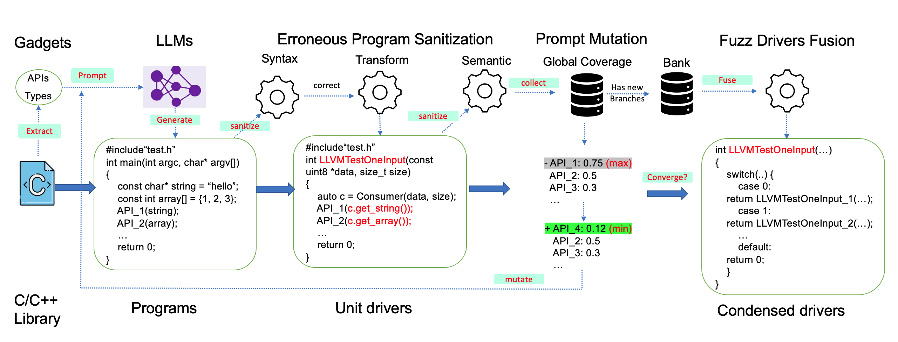

# Prompt Fuzzing for Fuzz Driver Generation
PromtFuzz is an automated tool that generates high-quality fuzz drivers for libraries via a fuzz loop constructed on mutating LLMs' prompts. The fuzz loop of PromptFuzz aims to guide the mutation of LLMs' prompts to generate programs that cover more reachable code and explore complex API interrelationships, which are effective for fuzzing.

Techincal Paper: [PDF](https://arxiv.org/pdf/2312.17677.pdf)

## Features
- **Multiply LLM support**: Codex, Inocder, ChatGPT and GPT4 (Current only tested on ChatGPT).
- **Context based Prompt**: Construct LLMs' prompts with the library knowledge required by API combinations.
- **Powerful Sanitization**: Sanitize erroneous programs on syntax, semantic, behavior and coverage based on static analysis and dynamic behaviors.
- **Prioritized Mutation**: Mutate the library API combination within LLM's prompts toward explore complex interrelationships by the guidance of code quality and code coverage.
- **Fuzz Driver Exploitation**: Infer API constraints by statistics and transform constant arguments to receive fuzzer' bytes.
- **Fuzz engine integration**: integrated with LibFuzzer.

## Code
The code of PromptFuzz is coming soon!

## 🏆Trophy
The fuzz drivers generated by PromptFuzz are able to detect a wide range of bugs, and most of them are security bugs.

For example, [CVE-2023-6277](https://nvd.nist.gov/vuln/detail/CVE-2023-6277) (CVSS 7.5 HIGH!) is a security bug found in libTIFF.

There are the uniquely interesting bugs detected by PromptFuzz:

| <b>ID<b> | **Library** | **Buggy Function**                          | **Bug Type** | **Status** | **Track Link** |
|-------------|------------------|-----------------------------------------|-------------------|-----------------|-------------------|
| 1.          | libaom           | highbd_8_variance_sse2                  | SEGV              | Confirmed       | [3489](https://bugs.chromium.org/p/aomedia/issues/detail?id=3489)              |
| 2.          | libaom           | av1_rc_update_framerate                 | Uninitialized Stack              | Confirmed       | [3509](https://bugs.chromium.org/p/aomedia/issues/detail?id=3509)              |
| 3.          | libaom           | timebase_units_to_ticks                 |  Integer Overflow               | Confirmed       | [3510](https://bugs.chromium.org/p/aomedia/issues/detail?id=3510)              |
| 4.          | libvpx           | vp8_peek_si_internal                    | SEGV              | Confirmed       | [1817](https://bugs.chromium.org/p/webm/issues/detail?id=1817)              |
| 5.          | libvpx           | update_fragments                        | Buffer Overflow                | Confirmed       | [1827](https://bugs.chromium.org/p/webm/issues/detail?id=1827)              |
| 6.          | libvpx           | vp8e_encode                             | Integer Overflow                | Confirmed       | [1828](https://bugs.chromium.org/p/webm/issues/detail?id=1828)              |
| 7.          | libvpx           | encode_mb_row                           | Integer Overflow                | Confirmed       | [1831](https://bugs.chromium.org/p/webm/issues/detail?id=1831)              |
| 8.          | libpng           | png_write_row                           | Buffer Overflow                | Waiting         | [491](https://github.com/glennrp/libpng/issues/491)               |
| 9.          | libpng           | png_read_row                            | TimeOut                | Waiting         | [492](https://github.com/glennrp/libpng/issues/492)               |
| 10.         | libmagic         | apprentice_map                          | Buffer Overflow                | Waiting         | [481](https://bugs.astron.com/view.php?id=481)               |
| 11.         | libmagic         | magic_setparam                          | Buffer Overflow                | Waiting         | [482](https://bugs.astron.com/view.php?id=482)               |
| 12.         | libmagic         | check_buffer                            | Buffer Overflow                | Confirmed         | [483](https://bugs.astron.com/view.php?id=483)               |
| 13.         | libmagic         | mget                                    | Integer Overflow                | Waiting         | [486](https://bugs.astron.com/view.php?id=486)               |
| 14.         | libTIFF          | TIFFOpen                                | OOM               | Confirmed       | [614](https://gitlab.com/libtiff/libtiff/-/issues/614)               |
| 15.         | libTIFF          | PixarLogSetupDecode                     | OOM               | Confirmed       | [619](https://gitlab.com/libtiff/libtiff/-/issues/619)               |
| 16.         | libTIFF          | TIFFReadEncodedStrip                    | OOM               | Confirmed       | [620](https://gitlab.com/libtiff/libtiff/-/issues/620)               |
| 17.         | libTIFF          | TIFFReadRGBAImageOriented               | OOM               | Confirmed       | [620](https://gitlab.com/libtiff/libtiff/-/issues/620)               |
| 18.         | libTIFF          | TIFFRasterScanlineSize64                | OOM               | Confirmed       | [621](https://gitlab.com/libtiff/libtiff/-/issues/621)               |
| 19.         | libTIFF          | TIFFReadRGBATileExt                     | SEGV              | Confirmed       | [622](https://gitlab.com/libtiff/libtiff/-/issues/622)               |
| 20.         | sqlite3          | sqlite3_unlock_notify                   | Null Pointer crash                | Confirmed       | [e77a5](https://www.sqlite.org/forum/forumpost/e77a5c3445)             |
| 21.         | sqlite3          | sqlite3_enable_load_extension           | Null Pointer crash                | Confirmed       | [9ce83](https://www.sqlite.org/forum/forumpost/9ce835fe96)             |
| 22.         | sqlite3          | sqlite3_db_config                       | Null Pointer crash                | Confirmed       | [5e3fc](https://www.sqlite.org/forum/forumpost/5e3fc453a6)             |
| 23.         | c-ares           | config_sortlist                         | Memory Leak                | Confirmed       | [d62627](https://github.com/c-ares/c-ares/commit/d62627e8b39ef793c3b1c7b054724b0d581eb4fb)           |
| 24.         | c-ares           | config_sortlist                         | Memory Leak                | Confirmed       | [d62627](https://github.com/c-ares/c-ares/commit/d62627e8b39ef793c3b1c7b054724b0d581eb4fb)           |
| 25.         | libjpeg-turbo    | tj3DecodeYUV8                           | Integer Overflow                | Confirmed       | [78eaf0](https://github.com/libjpeg-turbo/libjpeg-turbo/security/advisories/GHSA-x7cp-qgf3-9896)           |
| 26.         | libjepg-turbo    | tj3LoadImage16                          | OOM               | Confirmed       | [735](https://github.com/libjpeg-turbo/libjpeg-turbo/issues/735)               |
| 27.         | libpcap          | pcap_create                             | File Leak               | Confirmed       | [1233](https://github.com/the-tcpdump-group/libpcap/issues/1233)              |
| 28.         | libpcap          | pcapint_create_interface                | Null Pointer crash                | Confirmed       | [1239](https://github.com/the-tcpdump-group/libpcap/issues/1239)              |
| 29.         | libpcap          | pcapint_fixup_pcap_pkthdr               | Misaligned Address               | Confirmed       | -                 |
| 30.         | cJSON            | cJSON_ParseWithLengthOpts               | Buffer Overflow                | Waiting         | [804](https://github.com/DaveGamble/cJSON/issues/804)               |
| 31.         | cJSON            | cJSON_SetNumberHelper                   | Error Cast                | Confirmed         | [805](https://github.com/DaveGamble/cJSON/issues/805)               |
| 32.         | cJSON            | cJSON_CreateNumber                      | Error Cast                | Confirmed       | [806](https://github.com/DaveGamble/cJSON/issues/806)               |
| 33.         | cJSON            | cJSON_DeleteItemFromObjectCaseSensitive | TimeOut                | Confirmed       | [807](https://github.com/DaveGamble/cJSON/issues/807)               |
